# PayGateway — Payment Processing System

A full-stack **payment processing simulation** built with React, Node.js/Express and MongoDB. The project models the important backend problems found in payment systems—orders, payment attempts, idempotency, retries, webhook events, audit logs, authentication, rate limiting and failure handling—without connecting to real banking or card networks.

> **Important:** this project uses a simulated payment gateway. It does **not** process real money and does not integrate directly with Razorpay, Stripe, banks or wallets.

---

# 1. What This Project Does

At a high level:

```
User
  │
  ▼
React Checkout
  │
  │ JWT + Idempotency-Key
  ▼
Node.js / Express API
  │
  ├── Validate request
  ├── Check idempotency
  ├── Create Payment attempt
  ├── Run simulated payment engine
  ├── Update Payment + Order
  ├── Write transaction logs
  └── Dispatch simulated webhook
          │
          └── payment.failed
                  │
                  ▼
          AI Revenue Recovery Agent
          (optional, if configured)
```

The important idea is that an **Order** represents what the user wants to pay for, while a **Payment** represents one attempt to pay for that order.

---

# 2. Technology Stack

| Layer | Technology |
|---|---|
| Frontend | React, Vite, React Router |
| Styling | Custom CSS design system |
| Backend | Node.js, Express |
| Database | MongoDB + Mongoose |
| Authentication | JWT + bcrypt |
| Security | Helmet, CORS, express-validator, rate limiting |
| Payment simulation | Custom Node.js payment engine |
| Webhooks | HMAC SHA-256 signatures |
| Logging | Winston + transaction/audit logs |
| API documentation | Swagger / OpenAPI |
| Testing | Node.js test runner |
| Deployment | Render-compatible frontend/backend setup |

---

# 3. System Architecture

## 3.1 Complete Architecture

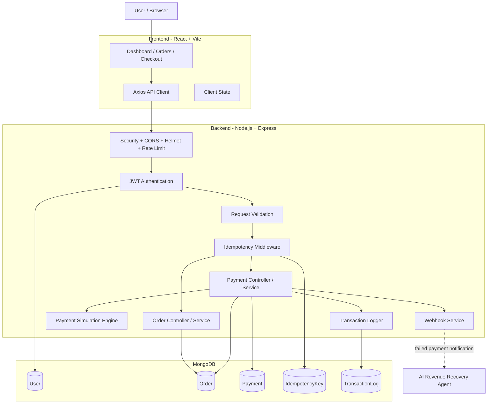

### Request path

```
Browser
  ↓
Axios
  ↓
Express
  ↓
Helmet / CORS / Rate Limit
  ↓
JWT Authentication
  ↓
Validation
  ↓
Idempotency
  ↓
Controller
  ↓
Service
  ↓
MongoDB / Payment Engine
```

---

# 4. Application Flow — From Login to Payment

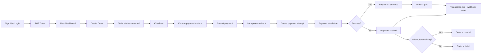

---

# 5. Authentication Flow

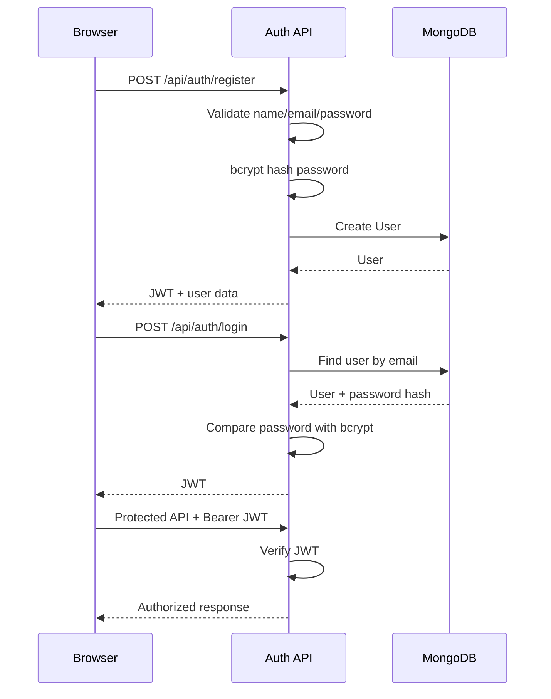

### Authentication responsibility

- Passwords are hashed with bcrypt.
- JWT is used for authenticated API requests.
- Protected routes require a valid bearer token.
- Admin routes additionally use role-based authorization.

---

# 6. Order Creation Flow

An order is created **before** the payment attempt.

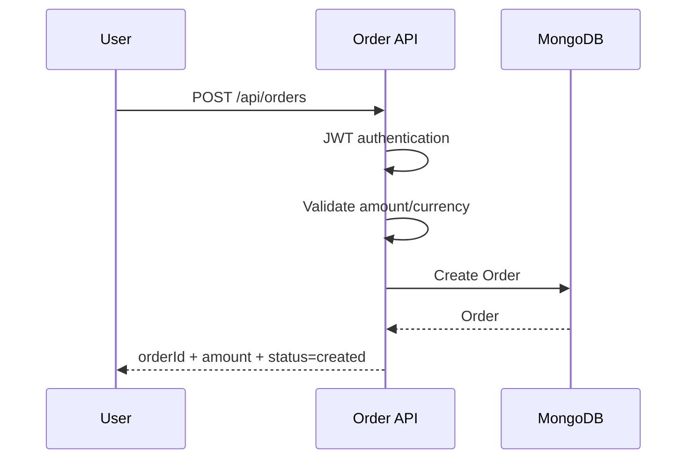

### Order contains

- `orderId`
- `userId`
- amount
- currency
- description
- metadata
- status
- attempts
- maxAttempts
- paidAt
- expiresAt

Default order expiry is **30 minutes**.

---

# 7. Payment Checkout Flow

This is the most important flow of the project.

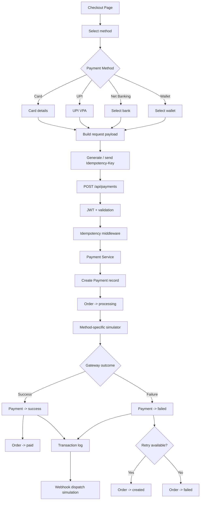

---

# 8. Payment Method Flows

## 8.1 Card

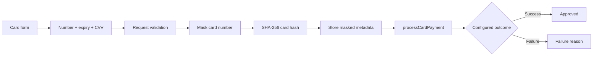

The CVV is **not stored**.

Stored card information is limited to safe metadata such as:

```
**** **** **** 4242
cardHash
cardType
expiryMonth
expiryYear
```

---

## 8.2 UPI

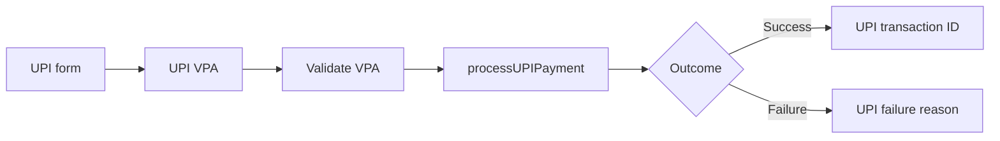

---

## 8.3 Net Banking

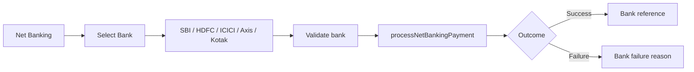

This is a **bank-selection simulation**. No real bank redirect/API is performed.

---

## 8.4 Wallet

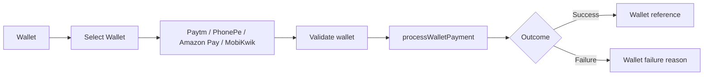

This is a **wallet simulation**. No real wallet transaction is performed.

---

# 9. Payment Engine

The payment engine is intentionally simulated because this project does not connect to a real financial network.

Each method now has its own simulation function:

```
paymentEngine.js

├── processCardPayment()
├── processUPIPayment()
├── processNetBankingPayment()
└── processWalletPayment()
```

### Common simulation pipeline

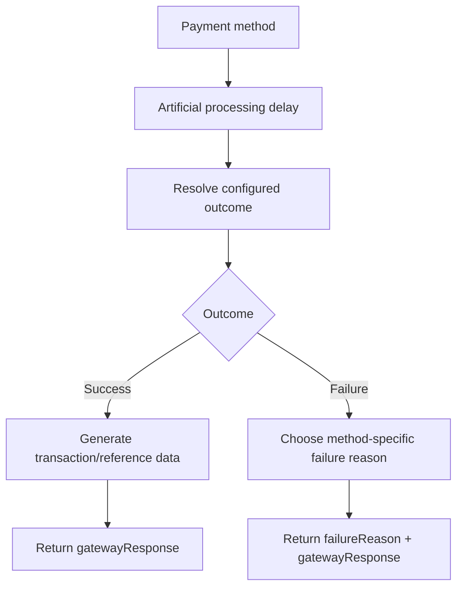

### Configurable behavior

```env
PAYMENT_SUCCESS_RATE=0.85
PAYMENT_MIN_DELAY_MS=500
PAYMENT_MAX_DELAY_MS=3000
PAYMENT_FORCE_OUTCOME=auto
```

Possible forced outcomes:

```
auto     -> use configured success probability
success  -> deterministic success
failure  -> deterministic failure
```

This makes automated testing easier without removing the normal simulation behavior.

---

# 10. Payment State Machine

## Order state

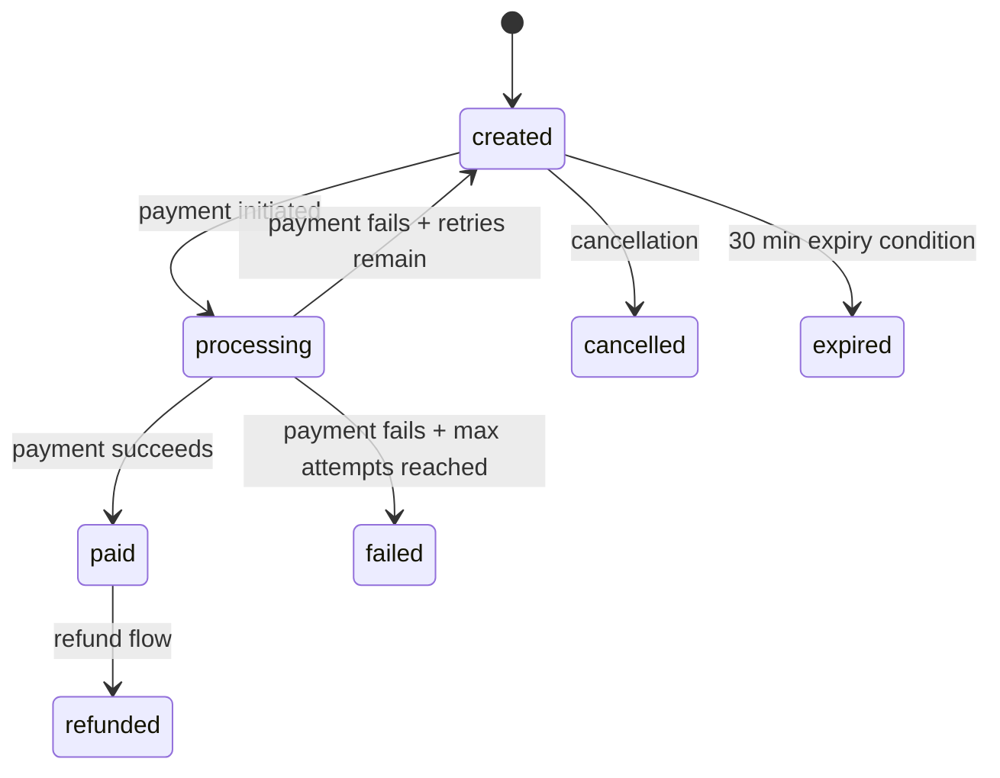

## Payment state

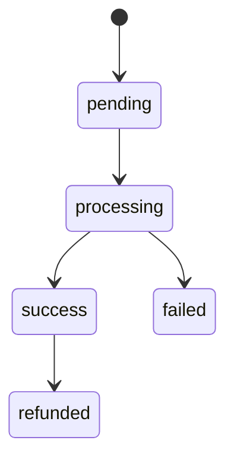

### Important distinction

```
ORDER
  = what needs to be paid

PAYMENT
  = one attempt to pay that order
```

For example:

```
Order ORD_123
   │
   ├── Payment attempt 1 -> failed
   ├── Payment attempt 2 -> failed
   └── Payment attempt 3 -> success
```

The order can still become **paid** even though earlier payment attempts failed.

---

# 11. Idempotency — The Most Important Reliability Concept

Payment requests can be retried because of:

- network timeout
- browser retry
- double click
- frontend retry
- client timeout

Without idempotency:

```
User clicks Pay
      ↓
Request reaches server
      ↓
Payment succeeds
      ↓
Response is lost
      ↓
Client retries
      ↓
Second payment could happen
```

With idempotency:

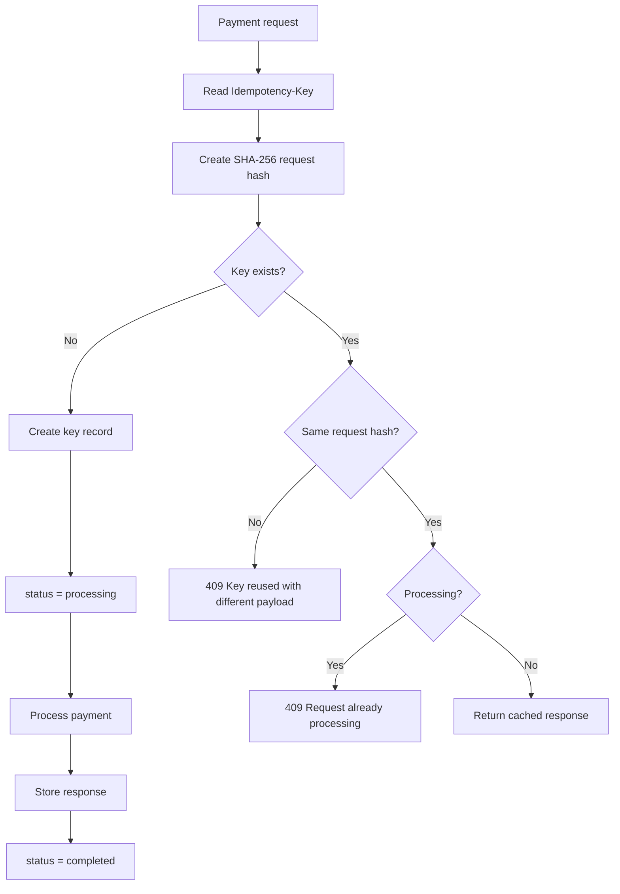

### Database protection

```
IdempotencyKey
    |
    +-- key
    +-- userId
    +-- requestHash
    +-- response
    +-- status
    +-- expiresAt
```

A unique compound index protects against concurrent requests racing to create the same key.

Keys expire automatically through MongoDB TTL after 24 hours.

---

# 12. Retry Flow

Each order has a maximum attempt count.

Default:

```
maxAttempts = 3
```

### Retry sequence

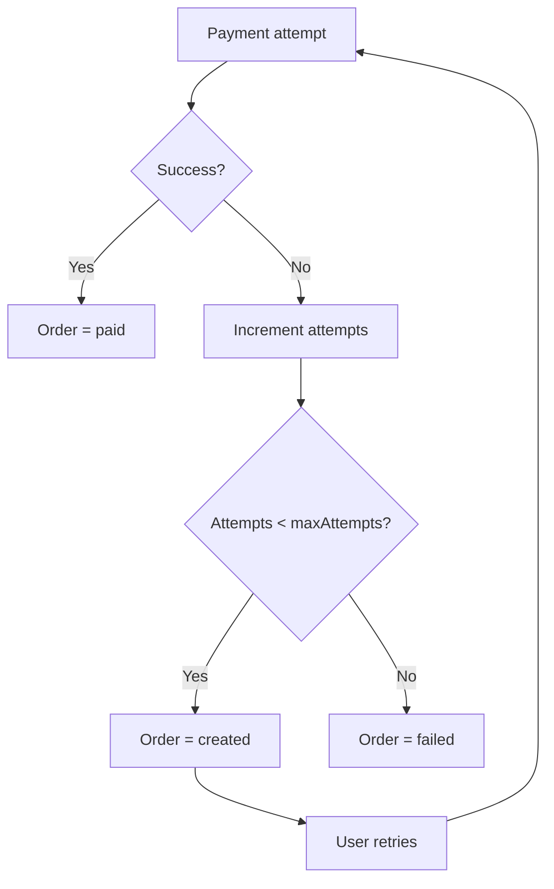

Example:

```
Attempt 1 -> FAILED -> 2 remaining
Attempt 2 -> FAILED -> 1 remaining
Attempt 3 -> SUCCESS -> ORDER PAID
```

---

# 13. Webhook Flow

The project models webhook dispatch as an asynchronous event after payment processing.

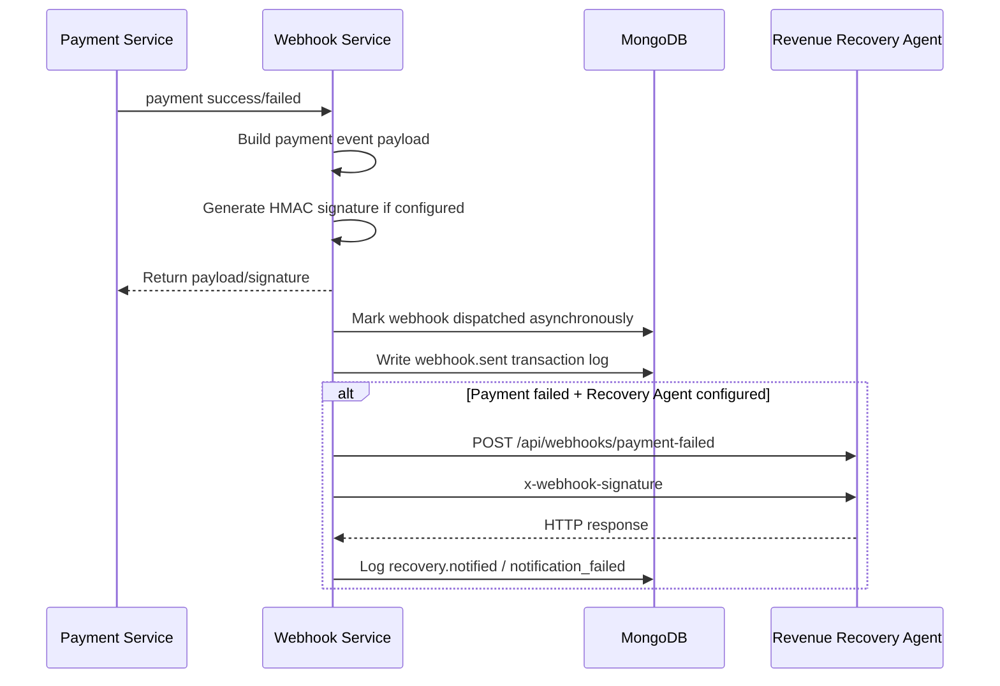

### Important implementation detail

The current webhook service **simulates asynchronous dispatch** rather than making an HTTP call back into its own `/api/webhooks/payment` endpoint.

The `POST /api/webhooks/payment` endpoint exists separately for receiving and verifying signed webhook payloads.

This distinction is important during an interview.

---

# 14. Webhook Signature

Webhook payloads can be signed using:

```
HMAC-SHA256(payload, WEBHOOK_SECRET)
```

The signature is sent using:

```
x-webhook-signature
```

### Verification flow

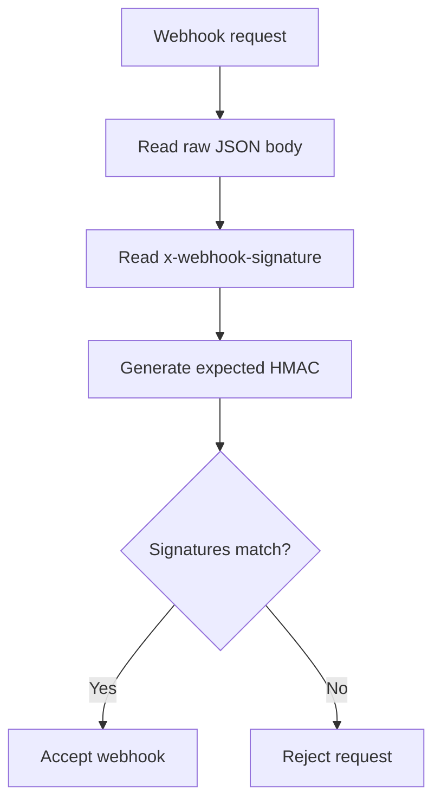

Raw body parsing is intentionally configured for the webhook route so the signature can be calculated against the original payload bytes.

---

# 15. Revenue Recovery Agent Integration

When a payment fails, the Payment Processing System can optionally notify the separate AI Revenue Recovery Agent.

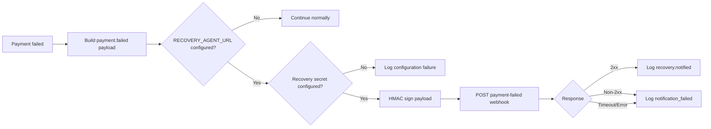

### Reliability rule

The payment result does **not** depend on the Revenue Recovery Agent.

In other words:

```
Payment failure
     |
     +----> Payment state is already recorded
     |
     +----> Recovery notification happens independently
```

A recovery-agent outage should not change the recorded payment state.

---

# 16. Transaction / Audit Logging

Major payment boundaries generate transaction events.

Typical events include:

```
payment.initiated
payment.processing
payment.success
payment.failed
payment.retry
webhook.sent
webhook.failed
recovery.notified
recovery.notification_failed
```

### Logging flow

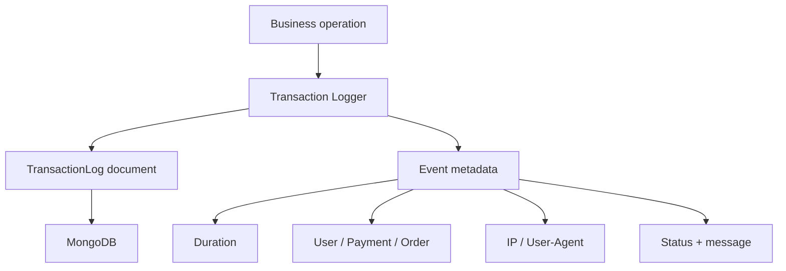

The transaction log gives the system an operational history that can be displayed in the transaction/admin views.

---

# 17. Database Design

## Entity relationship

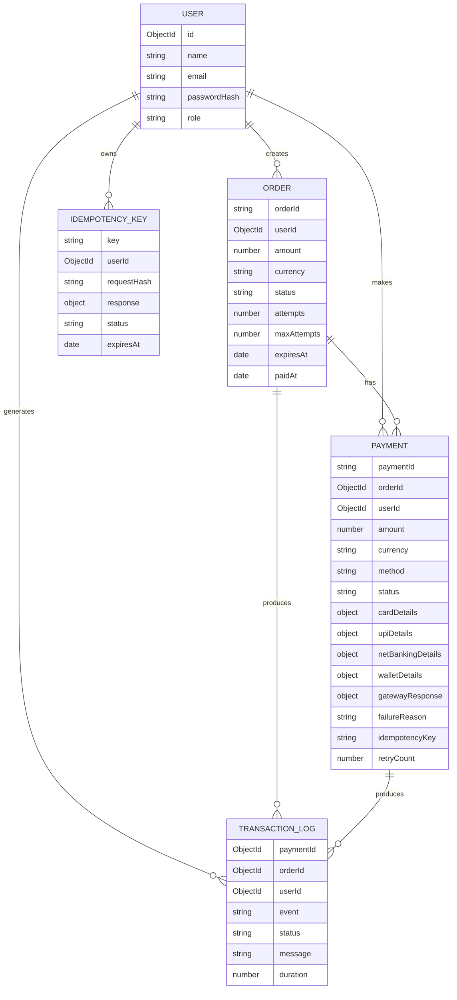

---

# 18. Why Order and Payment Are Separate

This is an important system-design decision.

Bad design:

```
Order = Payment
```

Better design:

```
Order
 |
 +-- Payment attempt #1
 |
 +-- Payment attempt #2
 |
 +-- Payment attempt #3
```

This allows the system to retain payment-attempt history while maintaining one overall order lifecycle.

---

# 19. API Request Lifecycle

## Payment API

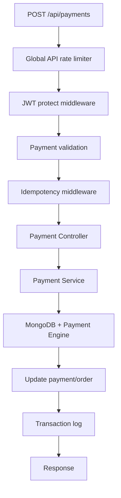

### Main payment endpoints

| Method | Endpoint | Purpose |
|---|---|---|
| POST | `/api/payments` | Initiate payment |
| POST | `/api/payments/retry` | Retry failed payment |
| GET | `/api/payments/my` | User payment history |
| GET | `/api/payments/:paymentId` | Payment details |
| GET | `/api/payments/admin/all` | Admin payment listing |
| GET | `/api/payments/admin/dashboard` | Admin payment metrics |

---

# 20. Complete Request-to-Database Flow

This is the diagram to remember for an interview.

```mermaid
flowchart TB
    A[User clicks Pay]
    A --> B[React PaymentPage]
    B --> C[Axios]
    C --> D[POST /api/payments]
    D --> E[JWT authentication]
    E --> F[Request validation]
    F --> G[Idempotency-Key]
    G --> H{Existing key?}

    H -->|Yes + same payload| I[Return cached response]
    H -->|Yes + different payload| J[409 conflict]
    H -->|Processing| K[409 in-progress]
    H -->|No| L[Create idempotency record]

    L --> M[Payment Service]
    M --> N[Find Order]
    N --> O[Validate order state/expiry]
    O --> P[Create Payment attempt]
    P --> Q[Order -> processing]

    Q --> R{Method}
    R -->|Card| S[Card simulator]
    R -->|UPI| T[UPI simulator]
    R -->|Net Banking| U[Bank simulator]
    R -->|Wallet| V[Wallet simulator]

    S --> W{Success?}
    T --> W
    U --> W
    V --> W

    W -->|Yes| X[Payment success]
    X --> Y[Order paid]
    Y --> Z[Transaction log]

    W -->|No| AA[Payment failed]
    AA --> AB[Update attempts]
    AB --> AC{Attempts remain?}
    AC -->|Yes| AD[Order created]
    AC -->|No| AE[Order failed]
    AD --> Z
    AE --> Z

    Z --> AF[Async webhook simulation]
    AF --> AG[Cache response]
    AG --> AH[Client]
```

---

# 21. Security Architecture

```mermaid
flowchart TD
    A[Incoming request] --> B[Helmet]
    B --> C[CORS]
    C --> D[Rate Limiter]
    D --> E{Protected route?}
    E -->|No| F[Continue]
    E -->|Yes| G[JWT verification]
    G --> H[Role check where required]
    H --> I[Input validation]
    I --> J[Business logic]
```

### Security measures actually implemented

- JWT authentication
- bcrypt password hashing
- Helmet security headers
- configurable CORS
- express-validator input validation
- API rate limiting
- payment-specific rate limiting
- card masking
- SHA-256 card hashing
- CVV never stored
- HMAC SHA-256 webhook signatures
- idempotency protection
- MongoDB TTL for idempotency records
- centralized error handling

> Rate limiting helps control abusive request volume; it should not be described as a complete DDoS protection system.

---

# 22. Error Handling Flow

```mermaid
flowchart LR
    A[Controller / Service] --> B{Error}
    B --> C[AppError]
    C --> D[Global error handler]
    D --> E[Structured HTTP response]
    D --> F[Winston logger]
```

Examples:

| Situation | Response |
|---|---|
| Missing JWT | Unauthorized |
| Invalid input | 400 |
| Order not found | 404 |
| Already paid | 409 |
| Idempotency conflict | 409 |
| Expired order | 410 |
| Maximum retries reached | 422 |
| Invalid webhook signature | Rejected |

---

# 23. Frontend Structure

```text
frontend/src/
├── components/
│   └── Layout.jsx
├── pages/
│   ├── LoginPage.jsx
│   ├── SignupPage.jsx
│   ├── DashboardPage.jsx
│   ├── OrdersPage.jsx
│   ├── PaymentPage.jsx
│   ├── TransactionsPage.jsx
│   └── AdminPage.jsx
├── services/
│   └── api.js
├── App.jsx
└── styles.css
```

### Frontend navigation

```mermaid
flowchart LR
    LOGIN[Login] --> DASH[Dashboard]
    SIGNUP[Signup] --> LOGIN
    DASH --> ORDERS[Orders]
    ORDERS --> CHECKOUT[Checkout]
    CHECKOUT --> RESULT[Payment Result]
    DASH --> TXN[Transactions]
    DASH --> ADMIN[Admin]
```

The UI is designed as a light fintech operations console with:

- order management
- checkout
- payment method selection
- transaction history
- operational dashboard
- admin analytics
- payment status badges
- responsive layouts

---

# 24. Backend Structure

```text
backend/
├── config/
│   ├── database.js
│   ├── logger.js
│   ├── payment.js
│   └── swagger.js
├── controllers/
│   ├── authController.js
│   ├── orderController.js
│   ├── paymentController.js
│   ├── transactionController.js
│   └── webhookController.js
├── middlewares/
│   ├── auth.js
│   ├── errorHandler.js
│   ├── idempotency.js
│   ├── rateLimiter.js
│   └── validators.js
├── models/
│   ├── User.js
│   ├── Order.js
│   ├── Payment.js
│   ├── TransactionLog.js
│   └── IdempotencyKey.js
├── services/
│   ├── paymentEngine.js
│   ├── paymentService.js
│   ├── webhookService.js
│   └── transactionLogger.js
├── routes/
│   ├── authRoutes.js
│   ├── orderRoutes.js
│   ├── paymentRoutes.js
│   ├── transactionRoutes.js
│   └── webhookRoutes.js
├── tests/
└── server.js
```

---

# 25. Configuration

Important environment variables:

```env
MONGO_URI=...
JWT_SECRET=...

PAYMENT_SUCCESS_RATE=0.85
PAYMENT_MIN_DELAY_MS=500
PAYMENT_MAX_DELAY_MS=3000
PAYMENT_FORCE_OUTCOME=auto

WEBHOOK_SECRET=...

RECOVERY_AGENT_URL=...
RECOVERY_WEBHOOK_SECRET=...
RECOVERY_WEBHOOK_TIMEOUT_MS=5000

SEED_ADMIN_PASSWORD=...
SEED_USER_PASSWORD=...
```

Never commit real secrets to Git.

---

# 26. Local Development

## Backend

```bash
cd backend
npm install
npm run dev
```

Backend:

```
http://localhost:5000
```

## Frontend

```bash
cd frontend
npm install
npm run dev
```

Frontend:

```
http://localhost:3000
```

The exact frontend port is controlled by the Vite configuration.

---

# 27. Testing Strategy

The payment engine supports deterministic test behavior through:

```env
PAYMENT_FORCE_OUTCOME=success
```

or:

```env
PAYMENT_FORCE_OUTCOME=failure
```

This prevents random simulation results from making automated tests flaky.

Current automated coverage includes:

- card hashing
- card masking
- card type detection
- webhook signature generation/verification
- card payment simulation
- UPI payment simulation
- malformed webhook handling
- invalid webhook signature handling

Run:

```bash
cd backend
npm test
```

---

# 28. Manual End-to-End Test Flow

## Successful payment

```
Login
 ↓
Create Order
 ↓
Open Checkout
 ↓
Select Card / UPI / Bank / Wallet
 ↓
Enter/select required details
 ↓
Click Pay
 ↓
Payment processing
 ↓
Payment success
 ↓
Order becomes paid
 ↓
Transaction appears in logs
```

## Failed payment

Set:

```env
PAYMENT_FORCE_OUTCOME=failure
```

Then:

```
Create Order
 ↓
Pay
 ↓
Payment failed
 ↓
Failure reason displayed
 ↓
Retry button available
 ↓
New payment attempt
```

## Idempotency test

Send the same request twice with the same:

```
Idempotency-Key
```

Expected behavior:

```
First request
    ↓
Payment processed

Second identical request
    ↓
Cached response
    ↓
idempotencyHit = true
```

---

# 29. What Is Real vs Simulated?

| Component | Status |
|---|---|
| User authentication | Real application logic |
| JWT authorization | Real application logic |
| MongoDB persistence | Real |
| Order management | Real |
| Payment records | Real |
| Idempotency | Real application logic |
| Retry workflow | Real application logic |
| Transaction logging | Real |
| Card processing | Simulated |
| UPI processing | Simulated |
| Bank processing | Simulated |
| Wallet processing | Simulated |
| Bank redirect | Not implemented |
| Real card network | Not connected |
| Real UPI network | Not connected |
| Real wallet API | Not connected |
| Real money movement | Not implemented |

This distinction should always be maintained when explaining the project in an interview.

---

# 30. Important Design Decisions

### Why idempotency?

To prevent duplicate payment processing when the client retries the same request.

### Why separate Order and Payment?

One order can have multiple payment attempts.

### Why store a transaction log?

To maintain an operational history of important payment events.

### Why simulate the gateway?

The project demonstrates payment-system engineering without connecting to real financial networks.

### Why use HMAC?

To allow the webhook receiver to verify that the payload was generated by a trusted sender holding the shared secret.

### Why asynchronous webhook dispatch?

Webhook delivery should not unnecessarily block the core payment result.

### Why does Recovery Agent failure not change payment state?

Payment state and recovery notification are separate concerns.

---

# 31. Scalability — Current Design vs Production Evolution

Current project:

```
React
  ↓
Express
  ↓
MongoDB
  ↓
In-process payment simulation
```

A production-scale evolution could be:

```mermaid
flowchart TB
    A[Clients] --> B[Load Balancer]
    B --> C[API Instances]
    C --> D[Payment Service]
    D --> E[(Primary Database)]
    D --> F[Message Queue]
    F --> G[Webhook Workers]
    F --> H[Recovery Workers]
    D --> I[Redis / Idempotency Cache]
    G --> J[Merchant / External Services]
```

These are **future architecture considerations**, not components currently implemented in this repository.

---

# 32. Interview — 60 Second Explanation

> “I built a full-stack payment processing simulation using React, Node.js, Express and MongoDB. The main goal was to model the reliability problems of payment systems rather than connect to a real bank. A user first creates an order and then starts a payment with a unique idempotency key. The backend validates the request, prevents duplicate processing, creates a payment attempt and sends it to a method-specific simulated payment engine for card, UPI, net banking or wallet. Based on the configured simulation outcome, the payment and order states are updated. Every important event is recorded in a transaction log, and payment events are dispatched asynchronously through a webhook service. Failed payments can be retried up to the order's maximum attempts, and failed payments can optionally notify an AI Revenue Recovery Agent.”

---

# 33. Interview — 2 Minute Architecture Explanation

> “The application follows a decoupled React frontend and Node.js/Express backend architecture with MongoDB as the persistence layer. Authentication is handled with JWT and passwords are hashed using bcrypt.
>
> The core domain is separated into Orders and Payments. An Order represents the amount that needs to be collected, while every payment attempt creates a separate Payment record. This lets the system support retries without losing the history of previous attempts.
>
> When the user clicks Pay, the frontend sends the order ID, payment method, method-specific details and an Idempotency-Key. The request passes through rate limiting, JWT authentication, validation and idempotency middleware. The idempotency layer hashes the request and either creates a processing record or returns the cached response for a duplicate request.
>
> The Payment Service validates the order, creates a payment attempt and changes the order to processing. It then calls a method-specific simulated payment engine. The engine introduces configurable latency and produces deterministic or probabilistic success/failure based on environment configuration.
>
> On success, the Payment becomes successful and the Order becomes paid. On failure, the Payment is marked failed and the order either returns to created for another attempt or becomes failed after the retry limit. Transaction events are recorded throughout the process. The webhook service then simulates asynchronous event delivery, and failed payments can optionally notify the Revenue Recovery Agent using an HMAC-signed request.”

---

# 34. Interview Questions You Should Be Ready For

### Q1. Why is idempotency required?

Because payment clients can retry requests. The same logical payment request should not create multiple payment attempts accidentally.

### Q2. What happens if two identical requests arrive simultaneously?

The unique `(key, userId)` index prevents both requests from claiming the same idempotency key. The losing request reads the existing record and returns the appropriate processing/cached response.

### Q3. Why don't you store the CVV?

CVV is highly sensitive payment authentication data and is not required after authorization. This project does not store it.

### Q4. Is the payment gateway real?

No. The payment gateway is simulated. MongoDB persistence, order/payment state transitions, idempotency, retries and logging are implemented application behavior.

### Q5. Why not call Razorpay?

The goal of this project is to demonstrate the architecture and reliability patterns of payment systems without requiring a real merchant account or moving real money.

### Q6. What happens when payment fails?

The payment becomes failed, the attempt count increases, and the order becomes either `created` for another retry or `failed` after the maximum number of attempts.

### Q7. What happens if the Recovery Agent is down?

The payment state remains unchanged. The notification failure is logged separately.

### Q8. What is the difference between Order and Payment?

An Order is the payment obligation. A Payment is one attempt to fulfill that obligation.

### Q9. How are webhook requests secured?

With an HMAC SHA-256 signature generated from the payload and shared secret.

### Q10. Why is the webhook endpoint unauthenticated?

Webhooks originate from external systems and therefore cannot use the application's normal user JWT. Instead, the webhook uses signature verification.

---

# 35. Common Interview Traps

Do **not** say:

- “I integrated Razorpay.”
- “I integrated Stripe.”
- “This processes real payments.”
- “This connects to real banks.”
- “The payment engine is a real gateway.”
- “Rate limiting provides complete DDoS protection.”
- “The Recovery Agent is required for payment success/failure.”

Say instead:

- “I built a payment processing simulation.”
- “The gateway behavior is simulated.”
- “The architecture models real payment-system reliability patterns.”
- “Bank and wallet selection are simulated provider flows.”
- “Idempotency and retry behavior are implemented in the backend.”
- “Webhook delivery is simulated asynchronously.”
- “The Recovery Agent integration is optional and independent of payment state.”

---

# 36. Quick Mental Model

Remember the project as these 8 steps:

```
1. AUTH
   ↓
2. ORDER
   ↓
3. IDEMPOTENCY
   ↓
4. PAYMENT ATTEMPT
   ↓
5. SIMULATED GATEWAY
   ↓
6. ORDER + PAYMENT STATE
   ↓
7. TRANSACTION LOG
   ↓
8. WEBHOOK / RECOVERY
```

If you understand these eight steps, you can explain most of the backend during an interview.

---

# 37. Final Architecture Cheat Sheet

```
                     PAYGATEWAY
                         │
              ┌──────────┴──────────┐
              │                     │
          FRONTEND                BACKEND
          React                   Express
              │                     │
          Checkout             JWT + Validation
              │                     │
              └──────────┬──────────┘
                         │
                  IDEMPOTENCY
                         │
                  PAYMENT SERVICE
                         │
          ┌──────────────┼──────────────┐
          │              │              │
        Order         Payment       Transaction
          │              │              │
          └──────────────┼──────────────┘
                         │
                  PAYMENT ENGINE
                         │
       ┌─────────┬───────┼───────┐
       │         │       │       │
      Card      UPI   NetBank  Wallet
       │         │       │       │
       └─────────┴───────┼───────┘
                         │
                  SUCCESS / FAILURE
                         │
              ┌──────────┴──────────┐
              │                     │
          Order State          Webhook Event
              │                     │
              │              Recovery Agent
              │                 (optional)
              │
             MongoDB
```

---

## Project Status

This repository is a **payment processing simulation and system-design project**. Its strongest engineering areas are:

- idempotent payment requests
- separate order/payment lifecycles
- retry handling
- method-specific payment simulation
- asynchronous webhook behavior
- HMAC signature verification
- transaction/audit logging
- JWT authentication and RBAC
- configurable payment simulation
- failure isolation for the Revenue Recovery Agent

The project should be presented as a **simulation of payment infrastructure**, not as a real payment gateway connected to financial networks.
